

## Introduction

This report presents two statistical analysis techniques in ANOVA (Analysis of Variance) and ANCOVA (Analysis of Covariance) with each applied into two biomedical datasets to evaluate treatment effects. The goal of the statistical analysis was to have an understanding of how different factors affect outcomes and whether those effects are significant.

The first dataset, Animal Survival Time, examines the effects of poison type and treatment on survival time, while the second dataset, Blood Pressure Treatment explores how various medicines/treatments affect post-treatment blood pressure (diastolic and systolic). These datasets were a fit to the statistical methods as they are widely used in health and biological studies. ANOVA aids in comparing group means to check if at least one is different, while ANCOVA on the other hand goes a step further by controlling another variable. Ultimately, these tools help in seeing if treatments really work or if differences are just by chance.

## Methodology

This statistical analysis was completely conducted in Microsoft Excel. The program provides users the ability to perform statistical analysis tasks with the help of add-ins. The data pre-processing includes importing the data using the *Get Data* function and transforming inside the *Power Query Editor*. Tasks such as removing errors and duplicates, specifying column data types and so on were handled in the Power Query Editor.

After that, the statistical analysis process was performed, the *Analysis Toolpak* add-in was utilized all throughout. The descriptive statistics were generated automatically using the add-in and manually using *PivotTables*, tables generated from these processes include mean, standard deviation, sample variance and so on. To further understand the data, several graphs and plots were visualized. After having all those things in place, the null and alternative hypotheses were formulated to prepare for the analysis phase.

In the Animal Survival Time dataset, the One-Way ANOVA test was performed to test if the poison type affects survival time or the mean time. The Two-Way ANOVA was consecutively performed to check the effects of both poison and treatment and see if both variables interact with each other.

For the Blood Pressure Treatment dataset, ANCOVA was used to see how post-treatment blood pressure changes after considering pre-treatment levels. Additionally, a simple linear regression was performed to model that relationship between pre- and post-treatment blood pressures, alongside computing the correlation between pre- and post-treatment variables.

## Results and Interpretation

The findings from the two analyses provided important insights into the effects of treatments/medication on blood pressure and poisons.

### Animal Survival Time (ANOVA)

The dataset was made up of 48 observations composed of three poison, four treatment and four replicates per group. The One-Way ANOVA showed that poison type significantly affected mean survival time.

  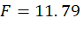

  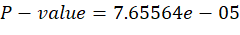

  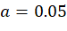

  
  

Post-hoc comparisons revealed that poison 3 was significantly different from poisons 1 and 2.

<b>POST-HOC TEST</b>

| Groups (poison) | P-value (T test) | Significant? |
| :--- | :--- | :--- |
| 1 v 2 | 0.419320742 | No |
| **2 v 3** | **0.001062402** | **Yes** |
| **3 v 1** | **6.99734E-07** | **Yes** |

  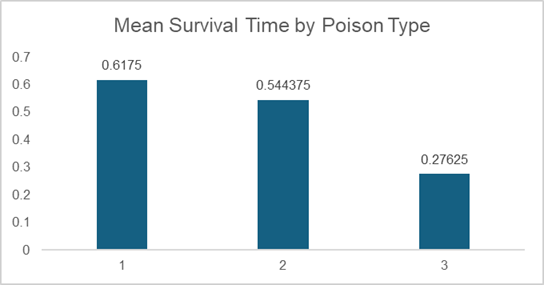

For the Two-Way ANOVA, both poison and treatment had significant effects, but their interaction was not significant.

| Factor | F-value | p-value | Interpretation |
| :--- | :--- | :--- | :--- |
| Poison (main effect) | 23.22 | 3.33e-07 | Significant difference among poisons |
| Treatment (main effect) | 13.81 | 3.77733e-06 | Significant difference among treatments |
| Interaction (Poison×Treatment) | 1.87 | 0.112 | No significant interaction |

  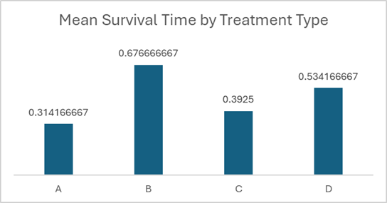  

Post-hoc comparisons uncovered that treatment A mean survival time is significantly different from mean survival times of treatment B and D. Treatment B mean survival time is significantly different from treatment C while it is not significantly different from treatment D. Treatment C is not significantly different from treatment A and D.

<b>POST-HOC TEST</b>

| Groups (treat) | P-value (T test) | Significant? |
| :--- | :--- | :--- |
| **A v B** | **0.001165176** | **Yes** |
| A v C | 0.179773695 | No |
| **A v D** | **0.004672031** | **Yes** |
| **B v C** | **0.012460458** | **Yes** |
| B v D | 0.217365628 | No |
| C v D | 0.088964569 | No |

While the findings from the One-Way ANOVA involving the poison type is consistent with the ones found in the Two-Way ANOVA. However, the interaction between the poison and treatment was found to be not significant, the effect of the treatment does not depend on poison type. This means that poison and treatment affect mean survival time independently.

  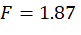

  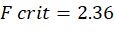

  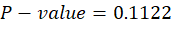

  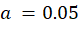

  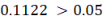

### Blood Pressure Treatment (ANCOVA)

| Correlation | | |
| :--- | :--- | :--- |
| | *predias* | *postdias* |
| *predias* | 1 | |
| *postdias* | 0.659230173 | 1 |

  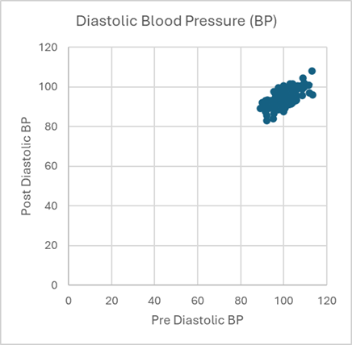  

There were 120 participants divided into four treatment/medicine groups: New Medicine, Old Medicine, Placebo, and None. The simple linear regression and ANCOVA results showed that the pre-treatment blood pressure was a strong predictor of post-treatment values.

| Regression Statistics | |
| :--- | :--- |
| Multiple R | 0.659230173 |
| R Square | 0.434584421 |
| Adjusted R Square | 0.429792763 |

 

| Correlation | | |
| :--- | :--- | :--- |
| | *presys* | *postsys* |
| *presys* | 1 | |
| *postsys* | 0.64503915 | 1 |

  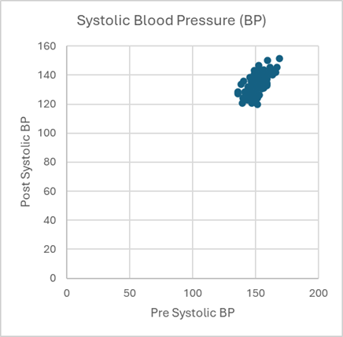

| Regression Statistics | |
| :--- | :--- |
| Multiple R | 0.64503915 |
| R Square | 0.416075505 |
| Adjusted R Square | 0.411126992 |

 

In terms of pre- and post-diastolic blood pressure, the None treatment group showed a significant difference compared to the Placebo group. The New and Old Medicine groups did not show any significant difference compared to Placebo. In conclusion, treatment or at least one treatment affected post-diastolic blood pressure.

<i>diastolic (a = 0.05)</i>

| Factor | p-value | Interpretation |
| :--- | :--- | :--- |
| Treatment (overall) | 2.66e-18 | Treatment affects post diastolic BP |
| None vs Placebo | 0.0056 | Significantly different post diastolic BP |
| New vs Placebo | 0.78 | No significant difference |
| Old vs Placebo | 0.23 | No significant difference |

 

On the other hand, pre- and post-systolic blood pressure, uncovered the same findings as its diastolic counterpart. The None treatment group also showed a significant difference compared to the Placebo Group while the New and Old Medicine groups did not show any significant differences compared to Placebo. With this in mind, treatment or at least one treatment affect post-systolic blood pressure.

<i>systolic (a = 0.05)</i>

| Factor | p-value | Interpretation |
| :--- | :--- | :--- |
| Treatment (overall) | 4.55e-16 | Treatment affects post systolic BP |
| None vs Placebo | 0.0066 | Significantly different post systolic BP |
| New vs Placebo | 0.70 | No significant difference |
| Old vs Placebo | 0.97 | No significant difference |

## Discussion and Conclusion

The results showed insightful stories regarding the statistical analysis of the two datasets. For the Animal Survival Time, both poison type and treatment significantly affected mean survival time. However, there was no significant interaction between the two variables, meaning the effect of treatment was consistent across poisons.

The Blood Pressure Treatment revealed that, neither the New nor old medicine significantly affected diastolic and systolic blood pressure compared to placebo. Those who received no medicine/treatment at all had higher diastolic and systolic blood pressures. These findings suggest that the medicines may not be more effective than a placebo in reducing blood pressure.

<i>diastolic</i>

| Factor | Coefficient | Interpretation |
| :--- | :--- | :--- |
| None vs Placebo | 2.22 | Elevated diastolic BP by 2.22 |
| New vs Placebo | -0.27 | Lowered diastolic BP by 0.27 |
| Old vs Placebo | -1.16 | Lowered diastolic BP by 1.16 |

 

<i>systolic</i>

| Factor | Coefficient | Interpretation |
| :--- | :--- | :--- |
| None vs Placebo | 3.27 | Elevated systolic BP by 3.27 |
| New vs Placebo | -0.56 | Lowered systolic BP by 0.56 |
| Old vs Placebo | 0.05 | Elevated systolic BP by 0.05 |

Overall, both analyses show how important it is to use the right statistical tools to correctly understand data. ANOVA can identify which factors matter the most, and ANCOVA can adjust for pre-existing differences.

## Appendix

All data were processed in Microsoft Excel using the Data *Analysis Toolpak* add-in. Descriptive statistics, ANOVA, and ANCOVA were computed directly Excel using the add-in. Included below are screenshots and tables that summarized how the analysis was performed.

### Appendix A: ANOVA

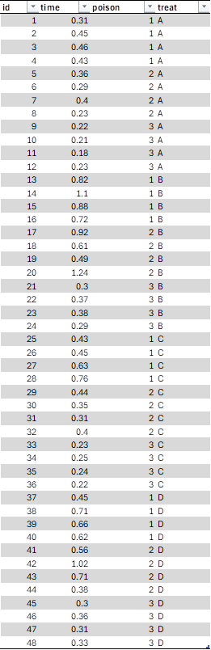
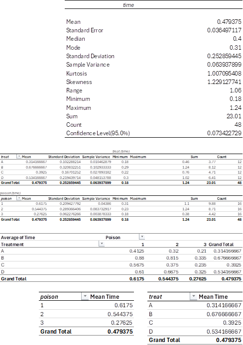
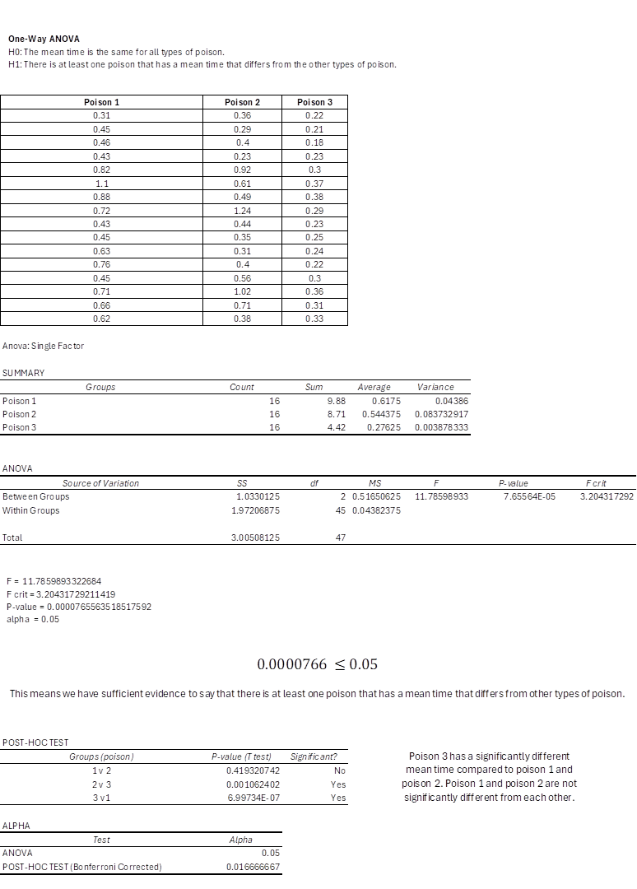
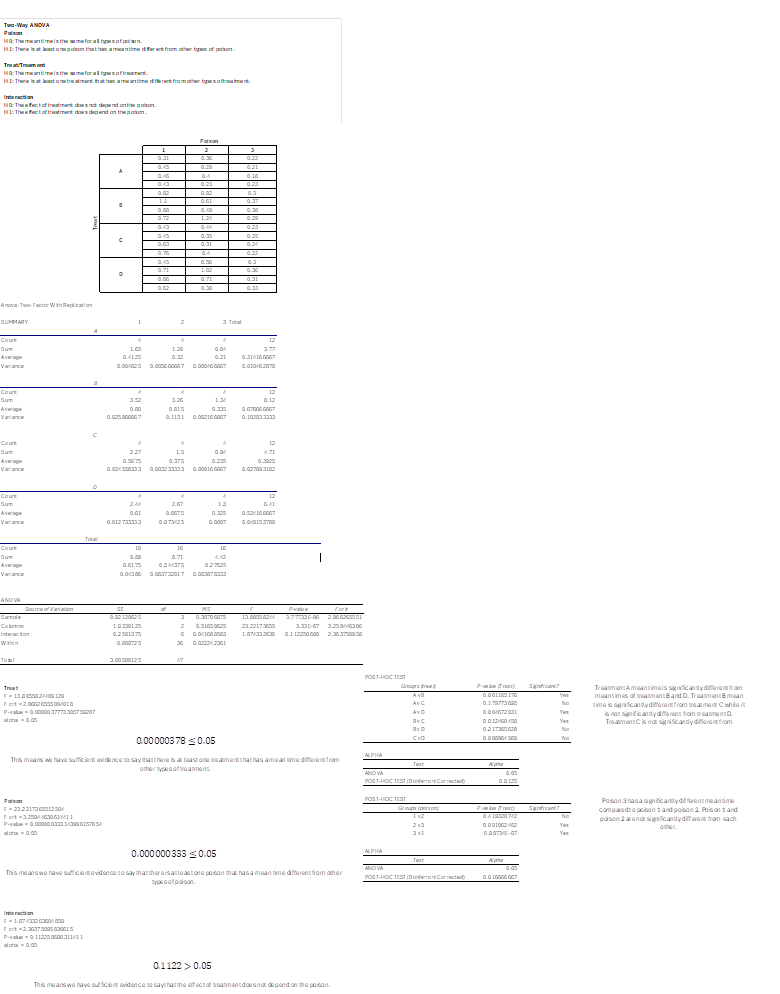

### Appendix B: ANCOVA

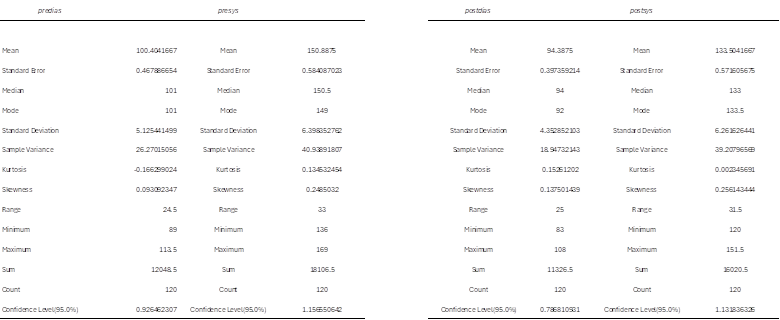
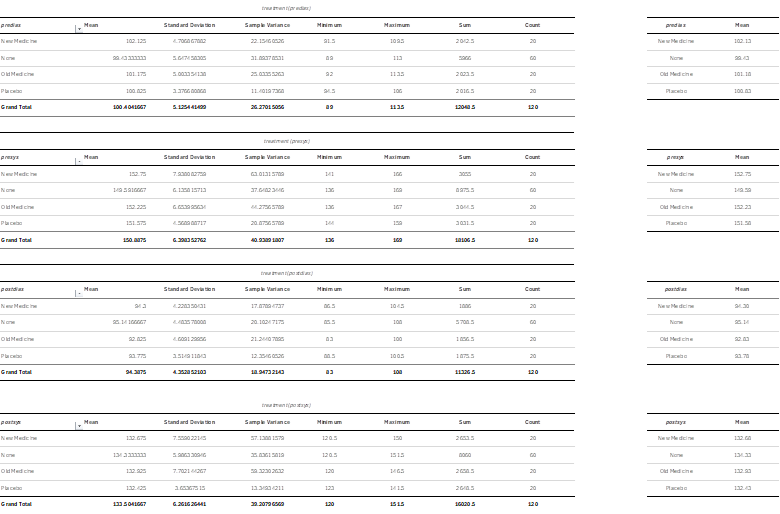
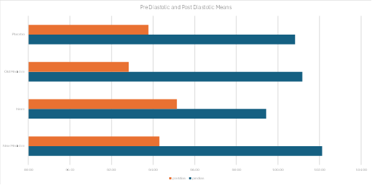
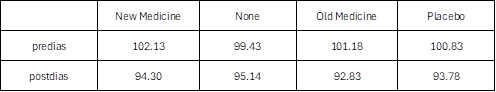

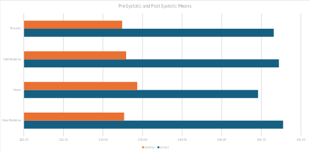
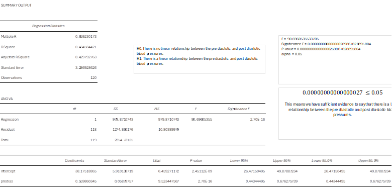
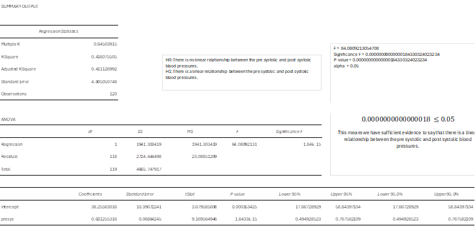
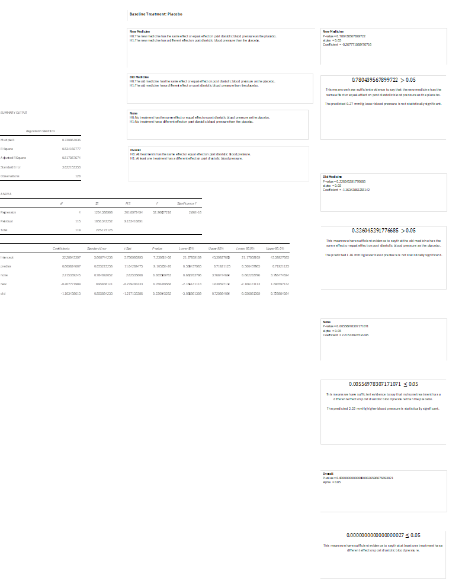
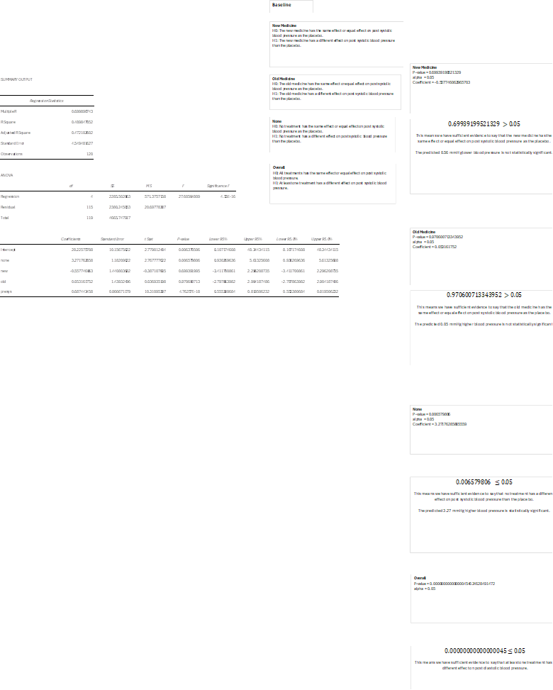

